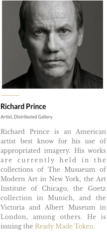

+++
title = "ready-made token"
template = "artworks.html"
+++

# ready-made token

silicium, solidity code, language

The ready-made token is a unique - though totally liquid - [ERC20](https://etherscan.io/token/0x067eefe485ec8659e0a4e7fe8b16f474653da244) token sold at auction on the [Ethereum](https://ethereum.org) blockchain. Its name and form - a non-sensitive artwork - draws a continuity with the Dada program: granting a sacredness to a random commodity through the performative gesture of an artist. The ready-made token turns a cryptographic unit of value into an artwork the same way Duchamp elevated a common object to the status of artwork.

The creation of the ready-made token has been a long linguistic and semantic trick questioning the arcane of the contemporary art world and market. Indeed, the ready-made token has been signed under the name of Richard Prince. But no material connection has ever been made between this Richard Prince - the one signing the ready-made token - and the [Richard Prince](https://en.wikipedia.org/wiki/Richard_Prince) everyone knows for his appropriation art.

This hazardous mistmatch has drawn a lot of attention towards the ready-made token, showing how tightly the mechanisms of value production in the art worlds are connected to « linguistic games » and attribution logics. The well known american artist Richard Prince ended up trapped in this hominimy game: he got invited to the prestigious [Rare Digital Art Festival](https://raredigitalartfestival.splashthat.com/), in New-York, to introduce the ready-made token.

## links

[ERC20 RMT on Etherscan](https://etherscan.io/token/0x067eefe485ec8659e0a4e7fe8b16f474653da244) | [browse the GitHub repo](https://github.com/distributedgallery/readymadetoken)

## caption of the Rare Digital Art Festival website

## tweets

<blockquote class="twitter-tweet" data-conversation="none" data-dnt="true">
At first I read this as Disturbed Gallery. Check.
&mdash; Richard Prince (@RichardPrince4) <a href="https://twitter.com/RichardPrince4/status/949453278915506176?ref_src=twsrc%5Etfw">January 6, 2018</a></blockquote> 

<blockquote class="twitter-tweet" data-conversation="none" data-dnt="true">
I have no idea what a blockchain is. That’s why I have one. Or not. I’m not sure. Maybe I do and don’t realize it. Anyway I still don’t know what it is.
&mdash; Richard Prince (@RichardPrince4) <a href="https://twitter.com/RichardPrince4/status/949504464674807808?ref_src=twsrc%5Etfw">January 6, 2018</a></blockquote> 

<blockquote class="twitter-tweet" data-conversation="none" data-dnt="true">
I didn’t make a token. I made a Ripple. But then someone took my Ripple and made a token.
&mdash; Richard Prince (@RichardPrince4) <a href="https://twitter.com/RichardPrince4/status/950229335046283264?ref_src=twsrc%5Etfw">January 8, 2018</a></blockquote> 

<blockquote class="twitter-tweet" data-dnt="true">
In before <a href="https://twitter.com/ReadyMadeToken?ref_src=twsrc%5Etfw">@ReadyMadeToken</a> Is one of the most important works of the blockchain era of art. A second coming of &quot;Fountain&quot;.
&mdash; Muhammad Khalifa (@mkhalifa503) <a href="https://twitter.com/mkhalifa503/status/952775076054732800?ref_src=twsrc%5Etfw">January 15, 2018</a></blockquote> 
